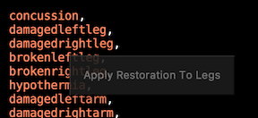
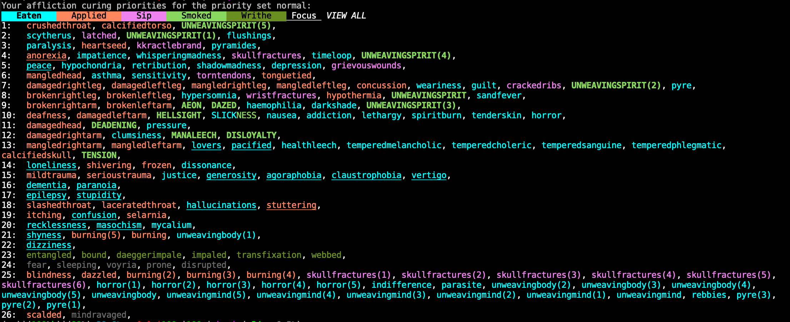
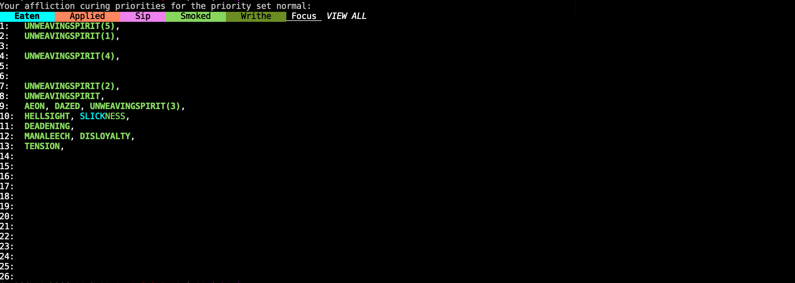

# Void Curing

An Achaean curing priority script

Void Curing allows you to more easily move your curing priorities without having to type in every command. Simply click an affliction and then click the priority you wish to move it into. Colors help distinguish the different curing queues. You may view individual queues by selecting the queue at the top of the display or typing VOID CURING _queue_

## Commands

- ### Typed commands:

  **void curing** - Display all of your curing priorities
  
  **void curing <_queue_>** - Display the specified queue. Options are _eat, apply, focus, sip, writhe, smoke_

- ### Mouse Commands:

  **Hover over affliction** - Display the cure for that affliction
  
  

  **Click affliction** - Select the affliction you wish to re-prioritize
  
  **Click priority number** - Deposit the selected affliction into that priority

- ### Example re-prio

   - Type **void curing eat**
   - Click on "paralysis"
   - Click "1:"
   - "Paralysis" has now been re-prioritized to position #1

  

## Examples

- VOID CURING
  

- VOID CURING SMOKE
  
  
